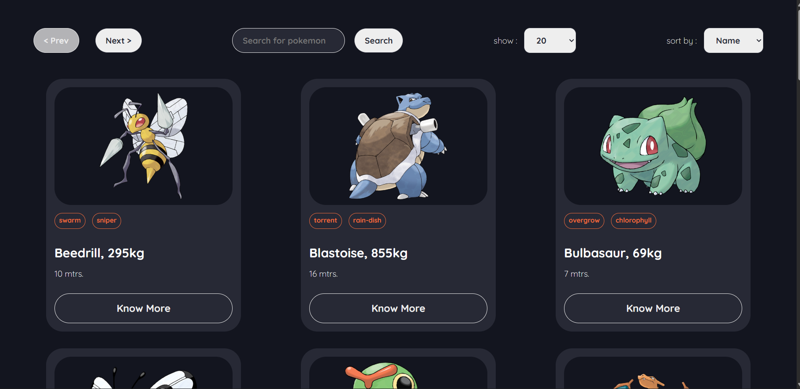

# 🔴 PokeDetail

> A sleek, fast Pokémon encyclopedia built with React — browse, search, sort, and dive deep into every Pokémon's stats, types, and abilities.



---

## ✨ Features

- 🔍 **Search** — Find any Pokémon instantly by name
- 📑 **Pagination** — Browse the full Pokédex with configurable page sizes (10 / 20 / 50 / 100)
- ↕️ **Sort** — Sort the listing by name or Pokémon ID
- 🃏 **Card View** — Each Pokémon is displayed in a clean card with its official artwork and type badge
- 📋 **Detail Page** — Click any card to view full details:
  - Official artwork
  - Height & Weight
  - Type(s)
  - Abilities
  - Base Stats
- ⬅️ **Back Navigation** — Smooth navigation back to the Pokémon list
- ⚡ **Loading Indicator** — Visual feedback while data is being fetched
- 🚫 **No Match State** — Graceful handling of empty search results

---

## 🛠️ Tech Stack

| Technology | Purpose |
|---|---|
| **React 18** | UI framework |
| **React Router v6** | Client-side routing |
| **Axios** | HTTP requests |
| **PokéAPI** | Pokémon data source (`https://pokeapi.co/`) |
| **CSS Modules** | Scoped component styling |
| **gh-pages** | GitHub Pages deployment |

---

## 🚀 Getting Started

### Prerequisites

- Node.js ≥ 16
- npm ≥ 8

### Installation

```bash
# 1. Clone the repository
git clone https://github.com/<your-username>/pokemon-app.git

# 2. Navigate into the project
cd pokemon-app

# 3. Install dependencies
npm install
```

### Running Locally

```bash
npm start
```

The app will open at **http://localhost:3006**

### Building for Production

```bash
npm run build
```

### Deploying to GitHub Pages

```bash
npm run deploy
```

---

## 🌐 API

All data is sourced from the free **[PokéAPI](https://pokeapi.co/)** — no API key required.

| Endpoint | Usage |
|---|---|
| `GET /api/v2/pokemon?limit={n}&offset={m}` | Paginated Pokémon list |
| `GET /api/v2/pokemon/{name or id}` | Single Pokémon details |

---

## 📄 License

This project is open source and available under the [MIT License](LICENSE).

---

<p align="center">Made with ❤️ and a lot of Pokéballs by Pratya Amrit</p>
